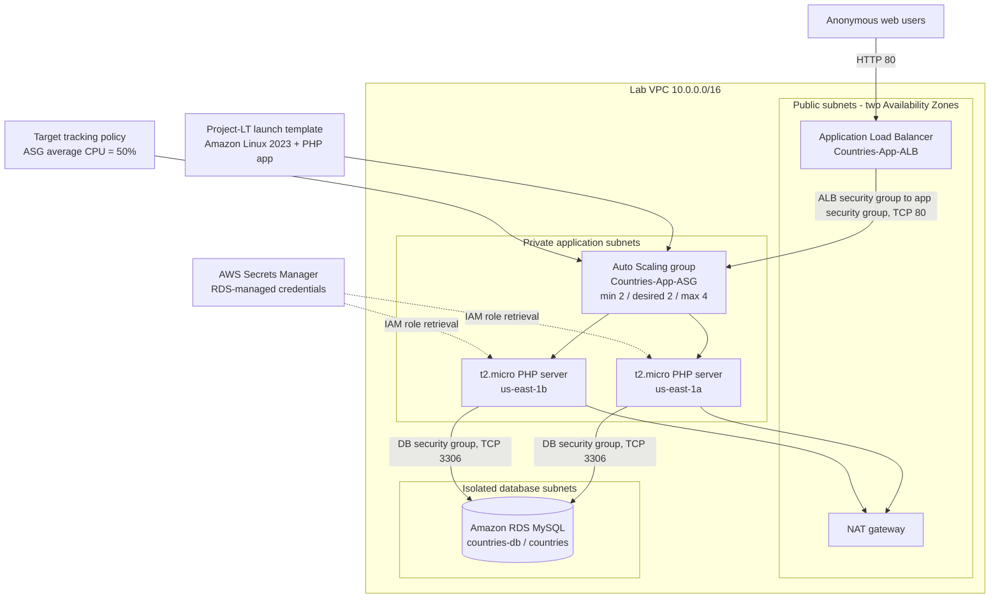

# AWS Academy Cloud Architecting Capstone

## Architecture diagram

## Design summary

- The only public application entry point is an internet-facing Application Load Balancer deployed across the two public subnets. Anonymous users can access the site over HTTP as required.
- The PHP application runs on two `t2.micro` Amazon Linux 2023 instances in separate private application subnets. The instances have no public IP addresses and are created by `Countries-App-ASG` from the supplied `Project-LT` launch template.
- The Auto Scaling group maintains two instances for Availability Zone resilience, can scale out to four instances, uses ELB health checks, and has a target-tracking policy for 50 percent average CPU utilization.
- The application security group accepts web traffic only from the ALB security group. The database security group accepts MySQL traffic only from the application security group.
- `countries-db` is a non-public Amazon RDS MySQL `db.t3.micro` instance in the isolated database subnet pair. The initial database is named `countries`.
- RDS manages the master credentials in AWS Secrets Manager. The application instances use the supplied IAM instance profile to discover the RDS endpoint and retrieve the secret at runtime, so credentials are not embedded in code or launch data.
- The provided SQL dump was imported into `countries.countrydata_final`; verification returned 214 country rows.
- Administrative access is available privately through AWS Systems Manager Session Manager using the provisioned IAM role, avoiding a public SSH endpoint.

## Verification evidence

- ALB DNS: `http://Countries-App-ALB-1679877860.us-east-1.elb.amazonaws.com`
- Both target group members report `healthy` in `us-east-1a` and `us-east-1b`.
- `index.php` and `query.php` return HTTP 200 through the ALB.
- A live `Q2` population query returned country, population, and urban-population data from RDS.
- RDS is `available`, `PubliclyAccessible=false`, and uses the two isolated database subnets.
