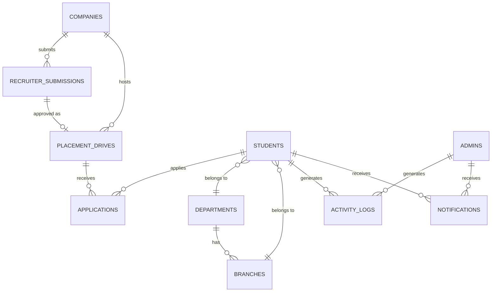

# PlacementX — Enterprise Database Architecture

This document defines the scalable Firebase Realtime Database schema for PlacementX, optimized for normalized data, high performance, and future AI integration.

## 1. Entity Relationship Diagram (ERD)



## 2. Complete JSON Schema

```json
{
  "students": {
    "student_id_1": {
      "personalInfo": {
        "firstName": "John",
        "lastName": "Doe",
        "gender": "male",
        "dob": "2000-01-01"
      },
      "academicInfo": {
        "departmentId": "dept_id_1",
        "branchId": "branch_id_1",
        "cgpa": 8.5,
        "batch": 2026,
        "semester": 6
      },
      "eligibility": {
        "isEligible": true,
        "activeBacklogs": 0,
        "totalBacklogs": 0
      },
      "contactDetails": {
        "email": "john.doe@nmims.edu",
        "phone": "+919876543210",
        "linkedin": "url"
      },
      "profileCompletion": 100,
      "resumeVersion": "v1.2",
      "createdAt": "2026-07-12T10:00:00Z",
      "updatedAt": "2026-07-12T10:00:00Z"
    }
  },

  "admins": {
    "admin_id_1": {
      "profile": {
        "name": "Admin Name",
        "email": "admin@nmims.edu"
      },
      "role": "superadmin",
      "permissions": ["manage_students", "manage_drives", "approve_submissions"],
      "departmentId": "global",
      "lastLogin": "2026-07-12T10:00:00Z",
      "createdAt": "2026-07-01T10:00:00Z"
    }
  },

  "companies": {
    "company_id_1": {
      "name": "Tech Corp",
      "website": "https://techcorp.com",
      "industry": "Software",
      "hrContact": {
        "name": "HR Name",
        "email": "hr@techcorp.com",
        "phone": "+919876543210"
      },
      "logoUrl": "https://storage.../logo.png",
      "description": "Enterprise software company.",
      "status": "active",
      "createdAt": "2026-07-01T10:00:00Z"
    }
  },

  "recruiterSubmissions": {
    "submission_id_1": {
      "submissionToken": "secure_token_xyz",
      "companyId": "company_id_1",
      "jobDescription": "Software Development Engineer...",
      "eligibilityCriteria": {
        "minCgpa": 7.5,
        "allowedBranches": ["branch_id_1", "branch_id_2"]
      },
      "salaryPackage": {
        "base": 1200000,
        "ctc": 1500000,
        "currency": "INR"
      },
      "bondDetails": "1 year",
      "location": "Mumbai",
      "deadline": "2026-08-01T23:59:59Z",
      "status": "Pending",
      "submittedAt": "2026-07-12T10:00:00Z",
      "reviewedBy": null,
      "reviewedAt": null,
      "remarks": ""
    }
  },

  "placementDrives": {
    "drive_id_1": {
      "driveName": "Tech Corp 2026 Recruitment",
      "companyId": "company_id_1",
      "submissionId": "submission_id_1",
      "eligibility": {
        "minCgpa": 7.5,
        "departments": ["dept_id_1"],
        "branches": ["branch_id_1", "branch_id_2"]
      },
      "registrationDeadline": "2026-08-01T23:59:59Z",
      "schedule": {
        "prePlacementTalk": "2026-08-05T10:00:00Z",
        "onlineTest": "2026-08-06T10:00:00Z",
        "interviews": "2026-08-10T10:00:00Z"
      },
      "visibility": "public",
      "status": "active",
      "createdAt": "2026-07-13T10:00:00Z"
    }
  },

  "applications": {
    "application_id_1": {
      "studentId": "student_id_1",
      "driveId": "drive_id_1",
      "status": "applied",
      "resumeVersion": "v1.2",
      "appliedAt": "2026-07-14T10:00:00Z",
      "updatedAt": "2026-07-14T10:00:00Z"
    }
  },

  "notifications": {
    "notification_id_1": {
      "targetType": "student",
      "targetId": "student_id_1",
      "title": "New Placement Drive",
      "message": "Tech Corp has opened registrations.",
      "read": false,
      "priority": "high",
      "createdAt": "2026-07-13T10:05:00Z"
    }
  },

  "activityLogs": {
    "log_id_1": {
      "actorId": "admin_id_1",
      "actorType": "admin",
      "action": "drive_approval",
      "targetId": "submission_id_1",
      "metadata": {
        "previousStatus": "Pending",
        "newStatus": "Approved"
      },
      "timestamp": "2026-07-13T10:00:00Z"
    }
  },

  "lookup": {
    "departments": {
      "dept_id_1": { "name": "Engineering", "code": "ENG" }
    },
    "branches": {
      "branch_id_1": { "name": "Computer Science", "departmentId": "dept_id_1" }
    },
    "statuses": {
      "application": ["applied", "shortlisted", "interviewed", "offered", "rejected"],
      "drive": ["draft", "active", "closed", "completed"]
    }
  },

  "settings": {
    "institution": {
      "name": "NMIMS University",
      "academicYear": "2025-2026"
    },
    "placement": {
      "maxApplicationsPerStudent": 5,
      "allowMultipleOffers": false
    }
  },

  "metadata": {
    "ai_extensions": {
      "student_id_1": {
        "predictedSuccessRate": 85,
        "recommendedCompanies": ["company_id_1", "company_id_3"],
        "lastAnalyzed": "2026-07-12T10:00:00Z"
      }
    }
  }
}
```

## 3. Relationship Explanations

- **Recruiter Submissions -> Placement Drives (1:0..1)**: Submissions are created independently via secure tokens. Once an admin approves a submission, a corresponding `PlacementDrive` is instantiated using the `submissionId` as a reference.
- **Students -> Applications (1:N)**: A student can have multiple applications. The application object stores strictly references (`studentId`, `driveId`) to prevent data duplication. To get applicant details, clients or Cloud Functions will join the student node.
- **Drives -> Applications (1:N)**: Similarly, querying applications by `driveId` allows admins to see all applicants.
- **Lookup Tables**: `departments` and `branches` are separated into a static `lookup` node. Students and Drives only store their IDs (`dept_id_1`). This ensures if a branch name changes, it automatically reflects everywhere.

## 4. Naming Conventions

- **Nodes/Collections**: `camelCase` and pluralized (e.g., `placementDrives`, `recruiterSubmissions`).
- **Keys/Fields**: `camelCase` (e.g., `registrationDeadline`, `companyId`).
- **Foreign Keys**: Always suffixed with `Id` (e.g., `studentId`, `companyId`).
- **Timestamps**: ISO 8601 Strings (`YYYY-MM-DDTHH:mm:ssZ`) to maintain standard UTC time.
- **Primary Keys (Push IDs)**: Use Firebase standard 20-character auto-generated push keys for entities, avoiding sequential IDs.

## 5. Firebase Best Practices

1. **Flatten Data Structures**: Data is completely normalized. We do not embed array lists of applications directly inside the `student` or `placementDrive` nodes. Instead, `applications` acts as a mapping table.
2. **Two-way Mapping / Fan-out**: For heavy read views (e.g., "Get all applications for a student"), use composite indexing or fan-out patterns in Firebase via Cloud Functions to duplicate mapping keys without duplicating entire entity payloads.
3. **Security Rules & Validation**: 
   - Write operations to `applications` must validate the `driveId` is active.
   - `recruiterSubmissions` is write-only for non-authenticated users possessing the exact `submissionToken`.
4. **Indexes**: Crucial `.indexOn` rules must be generated for `applications` on `studentId` and `driveId`, and for `recruiterSubmissions` on `submissionToken` and `status`.

## 6. Future AI Extension Points

The architecture strictly segregates AI-generated data from transactional core data. 
- **`metadata/ai_extensions` node**: This dedicated node stores all non-critical, asynchronously generated AI data (e.g., `predictedSuccessRate`, `recommendedCompanies`, embeddings). 
- **Why?** It prevents the core `students` node from becoming bloated with frequent AI metadata updates, which would trigger unnecessary re-renders in the UI or consume excessive realtime bandwidth. The AI can write here without modifying transactional logic.
