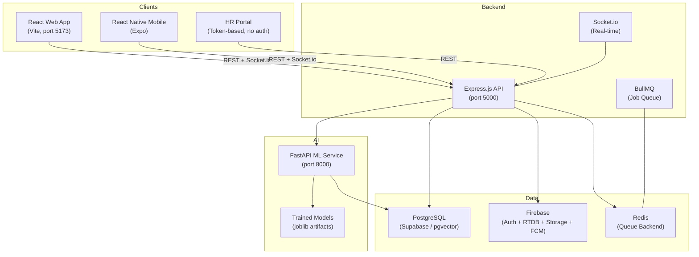
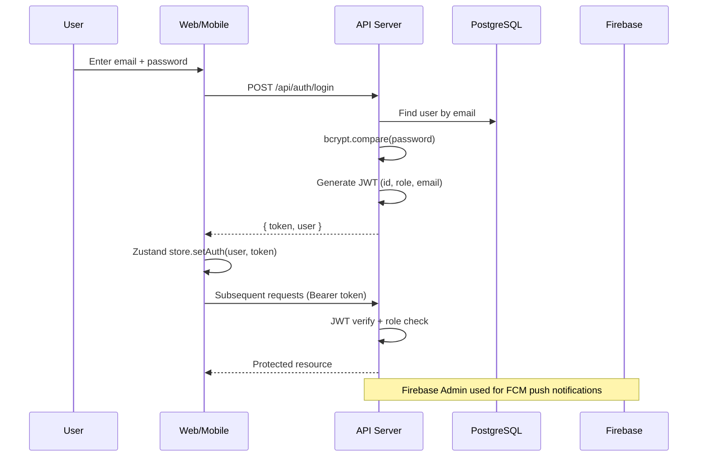

# Project Context

> Living documentation for AI-assisted development.

**Last Updated:** 2026-08-23 21:20 IST
**Last Verified Against Codebase:** 2026-08-23 21:20 IST
**Context Version:** 1.0

---

# 1. Project Overview

## Project Name

PlacementX

## Project Description

PlacementX is an **Intelligent Campus Placement Automation and Decision Support Platform** built as a capstone project for **NMIMS University**. It is a full-stack, multi-platform application (web + mobile + AI/ML microservice) designed to digitize and automate the entire campus placement lifecycle — from student profile management to company drive creation, HR collaboration, application tracking, analytics, and AI-driven decision support.

## Problem Being Solved

Manual, spreadsheet-driven campus placement processes at NMIMS University. The platform replaces fragmented communication (emails, WhatsApp groups, spreadsheets) with a unified digital solution for the Training & Placement Office (TPO), students, coordinators, and recruiters.

## Target Users

- **Students** — View drives, apply, manage profiles, track applications
- **Placement Cell (Super Admin / TPO)** — Manage drives, verify students, import data, view analytics
- **Coordinators** — Assist the placement cell with drive and student management
- **HR / Recruiters** — Collaborate on drive creation via secure token-based portal (no login required)

## Main Goals

1. End-to-end placement lifecycle automation
2. AI/ML-powered decision support (student success prediction, placement forecasting)
3. Real-time notifications (web + push via Firebase Cloud Messaging)
4. Multi-platform access (web now, React Native mobile in progress)
5. Analytics and reporting dashboard for the placement cell

## Current Status

**Development / MVP**

The core web application, backend API, and mobile app are all actively under development. Key features (auth, student profiles, placement drives, HR collaboration portal, notifications, analytics) are implemented. The ML microservice has trained models and API scaffolding. This is a university capstone project — not yet in production.

---

# 2. Core Features

| Feature | Purpose | User(s) | Status |
|---------|---------|---------|--------|
| **Unified Login** | Single login page routing by role | All | ✅ Completed |
| **Student Dashboard** | Overview of upcoming drives, stats, notifications | Student | ✅ Completed |
| **Student Profile Management** | Comprehensive multi-step profile form (personal, academic, professional) | Student | ✅ Completed |
| **Profile Verification** | Admin reviews and verifies student profiles | Admin | ✅ Completed |
| **Profile Update Requests** | Students request changes post-verification; admin approves/rejects | Student, Admin | ✅ Completed |
| **Placement Drive Management** | CRUD for placement drives with full eligibility criteria | Admin | ✅ Completed |
| **Create Drive Wizard** | Multi-step form for creating placement events | Admin | ✅ Completed |
| **HR Collaboration Portal** | Token-based, no-login wizard for HR to submit drive details | HR/Recruiter | ✅ Completed |
| **HR Drive Approval Workflow** | Admin approves/rejects/requests changes on HR-submitted drives | Admin | ✅ Completed |
| **Student Applications** | Students apply to eligible drives; track status | Student | ✅ Completed |
| **Eligibility Engine** | Automated eligibility checking (CGPA, backlogs, branch, etc.) | System | ✅ Completed |
| **Student Data Import (Excel)** | Bulk import students from Excel/CSV files | Admin | ✅ Completed |
| **Student Provisioning** | Auto-create accounts for imported students | Admin | ✅ Completed |
| **Analytics Dashboard** | Placement statistics, department breakdown, year comparison, salary analysis | Admin | ✅ Completed |
| **Notification System** | In-app notifications with BullMQ queue support | All | ✅ Completed |
| **Push Notifications (FCM)** | Firebase Cloud Messaging for mobile push | All | ✅ Completed |
| **Socket.io Real-time Updates** | Live notification delivery via WebSocket | All | ✅ Completed |
| **Calendar View** | Admin calendar for drive scheduling (FullCalendar) | Admin | ✅ Completed |
| **Reports Generation** | Exportable placement reports | Admin | 🚧 In Progress |
| **Admin Settings** | Coordinator management, system configuration | Admin | ✅ Completed |
| **Mobile App (React Native)** | Student-facing mobile app with Expo | Student | 🚧 In Progress |
| **AI Success Prediction** | ML model predicts student placement success probability | Admin, ML Service | ✅ Completed |
| **AI Placement Forecasting** | ML models forecast year-over-year placement metrics | Admin, ML Service | ✅ Completed |
| **AI Resume Parsing** | Extract structured data from uploaded resumes | System | ✅ Completed |
| **AI Embeddings** | Generate profile/job embeddings for semantic matching | System | ✅ Completed |
| **AI Admin Analytics** | Advanced AI analytics for admins | Admin | ✅ Completed |
| **Recruiter Event Portal** | Public recruiter event view via token | Recruiter | ✅ Completed |

---

# 3. User Roles & Permissions

| Role | Auth | Accessible Routes | Key Actions | Restrictions |
|------|------|-------------------|-------------|-------------|
| **STUDENT** | JWT + bcrypt login | `/student/*` | View drives, apply, manage profile, view applications/interviews/documents | Cannot access admin routes; profile locked after verification (must request update) |
| **SUPER_ADMIN** | JWT + bcrypt login | `/admin/*` | Full access: manage drives, students, coordinators, analytics, reports, notifications, calendar, settings, import data, verify profiles, review update requests | Full system access |
| **COORDINATOR** | JWT + bcrypt login | `/admin/*` | Same as SUPER_ADMIN (delegated by admin) | Created by SUPER_ADMIN; same route access |
| **HR/Recruiter** | Token-based (no login) | `/hr-drive/:token` | Submit drive details via wizard | Access only through unique invitation link with expiry; no account required |
| **Guest** | None | `/login`, `/about`, `/features`, `/modules`, `/how-it-works`, `/faq`, `/contact` | View public pages, login | Cannot access protected routes |

### Authentication Flow

1. User submits email + password to `POST /api/auth/login`
2. Backend verifies credentials via bcrypt, generates JWT
3. JWT stored in Zustand (persisted to localStorage as `placementx-auth`)
4. All subsequent API calls include `Authorization: Bearer <token>`
5. Backend middleware (`auth.middleware.ts`) verifies JWT and attaches `req.user`
6. Role-based authorization via `authorize(...roles)` middleware
7. Firebase Auth is also initialized for legacy/FCM support (`POST /api/auth/firebase-login`)
8. First login triggers forced password change (`mustChangePassword` flag)

### Route Guards (Frontend)

- `GuestRoute` — Only unauthenticated users (redirects to dashboard if logged in)
- `ProtectedStudentRoute` — Must be STUDENT role
- `ProtectedAdminRoute` — Must be SUPER_ADMIN or COORDINATOR
- `PublicRoute` — No auth required

## 23. Current Priorities

### Phase 1: Stabilization & Core (P0)

- `[x]` **P0.1 Enable Redis + BullMQ Notification Workers**
  - **Problem**: In `apps/api/src/index.ts`, the block starting with `// ─── Initialize Notification Queue Infrastructure ───────` is commented out or not functioning.
  - **Task**: Safely initialize Redis and queue workers. Include fallback/graceful shutdown so the API doesn't crash if Redis is unavailable.
- `[x]` **P0.2 Secure Analytics Routes**
  - **Problem**: `apps/api/src/routes/analytics.routes.ts` routes are currently completely unprotected.
  - **Task**: Add JWT authentication and authorize only `SUPER_ADMIN` and `COORDINATOR` roles.

### Phase 2: Complete Partially Implemented Features (P1)

- `[x]` **P1.1 Complete Mobile Core Screens**
  - **Problem**: `apps/mobile/src/screens/` has missing implementations for the student dashboard and profile view.
  - **Task**: Implement the remaining screens maintaining the existing React Native architecture.
- `[x]` **P1.2 Complete NLP Resume Parsing**
  - **Problem**: `ml-service/app/preprocessing/resume_processing.py` uses mock regex instead of the actual PyMuPDF + spaCy NLP logic.
  - **Task**: Replace the mock implementation with actual NLP extraction (NER). The ML service is already set up and dependencies are in `requirements.txt`.

### Phase 3: Fix Outstanding Architecture Debt (P2)

- `[x]` **P2.1 Consolidate Firebase Initialization**
  - **Problem**: Multiple controllers (`auth.controller.ts`, `admin.controller.ts`) initialize Firebase directly instead of using the central `config/firebase-admin.ts`.
  - **Task**: Merge all Firebase initialization logic into `config/firebase-admin.ts` and update controllers to use the shared export. Delete the redundant `firebaseAdmin.ts` file if it exists.
- `[x]` **P2.2 Formalize Shared Packages**
  - **Problem**: `packages/` contains UI and utility code but lacks proper `package.json` configurations.
  - **Task**: Add minimal `package.json` files to directories under `packages/` to support standard monorepo workspace imports.
- `[x]` **P2.3 Implement Report Export**
  - **Problem**: Admin dashboard has a report export button, but the backend endpoint is missing.
  - **Task**: Create `/export/excel` endpoint using the `xlsx` library to export student and placement data.
- `[x]` **P2.4 Complete Recruiter Event Portal**
  - **Problem**: Recruiter routes are incomplete and placeholder-only.
  - **Task**: Complete `recruiter.controller.ts` for candidate shortlisting and interview scheduling.
- `[x]` **P2.5 Standardize Backend Error Responses**
  - **Problem**: Error responses are inconsistent across the API.
  - **Task**: Create a central `AppError` class and an `error.middleware.ts` to handle formatting and status codes uniformly.

### Phase 4: Polish & Deployment Prep (P3)

- `[x]` **P3.1 CI/CD**
  - **Task**: Create a GitHub Actions workflow (`.github/workflows/main.yml`) that runs `npm run lint`, `npm run type-check`, and python tests on PRs to `main`.
- `[x]` **P3.2 Code Splitting**
  - **Task**: Ensure the frontend router uses `React.lazy` for all major feature modules to reduce initial bundle size.
- `[x]` **P3.3 Remove Unused Dependencies**
  - **Task**: Clean up `package.json` and remove unused libraries.
- `[x]` **P3.4 Update `.env.example`**
  - **Task**: Ensure all new environment variables required by the recent implementations (like Redis) are documented.

---

# 4. Technology Stack

## Frontend (Web) — `apps/web`

| Concern | Technology | Version |
|---------|-----------|---------|
| Framework | React | ^18.3.1 |
| Language | TypeScript | ~6.0.2 |
| Build Tool | Vite | ^8.1.1 |
| Styling | Tailwind CSS v4 | ^4.3.2 |
| Component Library | shadcn/ui (via `components.json`) | Latest |
| State Management (Client) | Zustand | ^4.5.7 |
| Server State | TanStack React Query | ^5.101.2 |
| Routing | React Router DOM v7 | ^7.18.1 |
| Forms | React Hook Form | ^7.81.0 |
| Validation | Zod | ^4.4.3 |
| HTTP Client | Axios | ^1.18.1 |
| Icons | Lucide React | ^1.24.0 |
| Animations | Framer Motion | ^12.42.2 |
| Charts | Recharts | ^3.9.2 |
| Calendar | FullCalendar React | ^6.1.15 |
| Notifications (Toast) | Sonner + React Hot Toast | Latest |
| Date Utilities | date-fns | ^4.4.0 |
| PDF Generation | jsPDF + html2canvas | Latest |
| CSV/Excel Parsing | PapaParse + xlsx | Latest |
| Maps | react-simple-maps | ^3.0.0 |
| Real-time | Socket.io Client | ^4.8.3 |
| Firebase SDK | firebase | ^12.16.0 |

## Frontend (Mobile) — `apps/mobile`

| Concern | Technology | Version |
|---------|-----------|---------|
| Framework | React Native (Expo) | 0.81.5 / Expo ~54.0.0 |
| Language | TypeScript | ~5.9.2 |
| Navigation | React Navigation (native-stack, bottom-tabs, drawer) | ^7.x |
| State Management | Zustand | ^5.0.14 |
| Server State | TanStack React Query | ^5.101.4 |
| HTTP Client | Axios | ^1.18.1 |
| Push Notifications | expo-notifications | ~0.32.17 |
| Secure Storage | expo-secure-store | ~15.0.8 |
| Icons | lucide-react-native | ^1.27.0 |
| Real-time | Socket.io Client | ^4.8.3 |
| Firebase SDK | firebase | ^12.17.0 |

## Backend (API) — `apps/api`

| Concern | Technology | Version |
|---------|-----------|---------|
| Runtime | Node.js | ≥ 20.x |
| Language | TypeScript | ^5.1.6 |
| Framework | Express.js | ^4.18.2 |
| ORM | Prisma | ^5.0.0 |
| Database | PostgreSQL (via Supabase / local pgvector) | Latest |
| Authentication | bcrypt + JSON Web Tokens (jsonwebtoken) | ^5.1.0 / ^9.0.3 |
| Firebase Admin | firebase-admin | ^13.10.0 |
| Real-time | Socket.io | ^4.8.3 |
| Job Queue | BullMQ | ^6.0.0 |
| Cache/Queue Backend | Redis (ioredis) | ^5.11.1 |
| Validation | Zod | ^3.21.4 |
| Excel Parsing | xlsx | ^0.18.5 |
| DB Driver | pg | ^8.22.0 |
| Supabase Client | @supabase/supabase-js | ^2.112.3 |

## ML Service — `ml-service`

| Concern | Technology |
|---------|-----------|
| Runtime | Python 3.10 |
| Framework | FastAPI + Uvicorn |
| ML Libraries | scikit-learn, XGBoost |
| Data Processing | pandas, NumPy |
| NLP | spaCy (en_core_web_sm) |
| Embeddings | sentence-transformers (all-MiniLM-L6-v2) |
| Resume Parsing | PyMuPDF, python-docx |
| Database | SQLAlchemy + psycopg2-binary (PostgreSQL) |
| Model Serialization | joblib |
| Containerization | Docker |

## Database

| Concern | Detail |
|---------|--------|
| **Primary DB** | PostgreSQL (Supabase-hosted for cloud, pgvector Docker for local dev) |
| **ORM** | Prisma (schema at `apps/api/prisma/schema.prisma`) |
| **Legacy DB** | Firebase Realtime Database (auth + some legacy data; being migrated) |
| **Local Dev DB** | SQLite (`prisma/dev.db`) exists for quick local development |
| **Vector Extension** | pgvector v0.5.1 (for AI embeddings in Docker setup) |

## Infrastructure

| Concern | Detail |
|---------|--------|
| Containerization | Docker + docker-compose (PostgreSQL + ML service) |
| Cloud Backend | Firebase (Auth, Realtime DB, Cloud Storage, FCM) |
| Cloud Database | Supabase (PostgreSQL hosting) |
| Queue Backend | Redis (for BullMQ notification queue) |
| Real-time | Socket.io (web + mobile) |

## Development Tools

| Tool | Detail |
|------|--------|
| Package Manager | npm (workspaces) |
| Monorepo | npm workspaces (`apps/*`, `packages/*`) |
| Code Formatting | Prettier ^3.9.5 |
| Linting | ESLint |
| Editor Config | `.editorconfig` |
| Path Aliases | `@/*` → `src/*` (Vite + tsconfig) |
| Dev Runner | `concurrently` (runs API + web simultaneously) |
| API Dev Server | ts-node-dev (auto-restart) |

---

# 5. Repository Structure

```
PlacementX/
├── apps/
│   ├── api/                        # Express.js backend API
│   │   ├── prisma/
│   │   │   ├── schema.prisma       # Database schema (source of truth)
│   │   │   └── dev.db              # Local SQLite dev database
│   │   ├── src/
│   │   │   ├── config/             # Firebase Admin, Redis config
│   │   │   ├── controllers/        # Route handlers (business logic)
│   │   │   ├── middlewares/        # Auth (JWT), authorization
│   │   │   ├── routes/             # Express route definitions
│   │   │   ├── services/           # Business services (eligibility, notifications, push, queue)
│   │   │   ├── socket/             # Socket.io initialization
│   │   │   ├── utils/              # Utility helpers
│   │   │   ├── index.ts            # Server entry point
│   │   │   └── seed.ts             # Database seed script
│   │   ├── scripts/                # Utility scripts
│   │   ├── package.json
│   │   └── tsconfig.json
│   │
│   ├── web/                        # React (Vite) web application
│   │   ├── src/
│   │   │   ├── app/                # App-level setup
│   │   │   ├── components/         # Shared UI components
│   │   │   │   ├── common/         # Loading, NotFound, Unauthorized
│   │   │   │   ├── layout/         # Layout utilities
│   │   │   │   ├── navigation/     # Navigation components
│   │   │   │   └── ui/             # shadcn/ui primitives
│   │   │   ├── config/             # Firebase config, env, navigation, theme
│   │   │   ├── contexts/           # React context providers
│   │   │   ├── features/           # Feature-based modules
│   │   │   │   ├── admin/          # Admin dashboard, drives, students, etc.
│   │   │   │   ├── auth/           # Login pages
│   │   │   │   ├── hr-portal/      # HR drive wizard
│   │   │   │   ├── notifications/  # Notification components/pages
│   │   │   │   ├── public/         # Landing, About, FAQ, etc.
│   │   │   │   └── student/        # Student dashboard, profile, applications
│   │   │   ├── hooks/              # Custom hooks (queries, FCM, notifications)
│   │   │   ├── layouts/            # Page layouts (Student, Admin, HR, Auth, Public)
│   │   │   ├── lib/                # Utility functions
│   │   │   ├── providers/          # React context providers
│   │   │   ├── routes/             # Router config + route guards
│   │   │   ├── services/           # API service layer (Axios)
│   │   │   ├── stores/             # Zustand stores (authStore)
│   │   │   ├── styles/             # Additional CSS
│   │   │   ├── types/              # TypeScript types
│   │   │   └── index.css           # Tailwind CSS v4 entry
│   │   ├── index.html
│   │   ├── vite.config.ts
│   │   ├── components.json         # shadcn/ui config
│   │   └── package.json
│   │
│   └── mobile/                     # React Native (Expo) mobile app
│       ├── src/
│       │   ├── components/         # Mobile UI components
│       │   ├── config/             # Mobile config
│       │   ├── hooks/              # Mobile hooks
│       │   ├── lib/                # Mobile utilities
│       │   ├── navigation/         # React Navigation setup
│       │   ├── providers/          # Mobile providers
│       │   ├── screens/            # Screen components (admin, auth, shared, student)
│       │   ├── services/           # Mobile API services
│       │   ├── stores/             # Mobile state stores
│       │   ├── theme/              # Mobile theming
│       │   └── types/              # Mobile types
│       ├── App.tsx                  # Root component
│       ├── index.ts                # Entry point
│       ├── app.json                # Expo configuration
│       └── package.json
│
├── packages/                       # Shared monorepo packages
│   ├── assets/                     # Shared assets
│   ├── config/                     # Shared configuration
│   ├── constants/                  # Shared constants
│   ├── firebase/                   # Shared Firebase config
│   ├── hooks/                      # Shared hooks
│   ├── types/                      # Shared TypeScript types (user, student, company, etc.)
│   ├── ui/                         # Shared UI components
│   ├── utils/                      # Shared utilities
│   └── validation/                 # Shared validation schemas
│
├── ml-service/                     # Python FastAPI ML microservice
│   ├── app/
│   │   ├── api/                    # FastAPI route handlers
│   │   ├── database/               # Database connection
│   │   ├── models/                 # ML model definitions
│   │   ├── preprocessing/          # Data preprocessing
│   │   ├── schemas/                # Pydantic schemas
│   │   ├── services/               # ML service logic
│   │   └── main.py                 # FastAPI entry point
│   ├── artifacts/                  # Trained model files (.joblib)
│   ├── datasets/                   # Training datasets
│   ├── reports/                    # Training reports
│   ├── tests/                      # ML tests
│   ├── training/                   # Training scripts
│   ├── Dockerfile
│   └── requirements.txt
│
├── Student_data/                   # Raw student data (Excel files for import)
│   ├── Current/                    # Current year data
│   └── previous/                   # Historical data
│
├── All Prompts/                    # AI development prompts used during building
│
├── .env.example                    # Environment variable template
├── database.rules.json             # Firebase Realtime Database security rules
├── database_architecture.md        # Firebase DB architecture documentation
├── database_scheme.md              # Firebase DB schema documentation
├── docker-compose.yml              # Docker: PostgreSQL (pgvector) + ML service
├── excel_schema.json               # Excel import schema definition
├── login_credentials.md            # Test account credentials
├── run.bat                         # Windows dev startup script
├── run.sh                          # Unix dev startup script
├── package.json                    # Root monorepo package.json
├── ARCHITECTURE.md                 # System architecture documentation
└── README.md                       # Project README
```

### Key Directories — What NOT to Modify Carelessly

| Directory | Warning |
|-----------|---------|
| `apps/api/prisma/schema.prisma` | Source of truth for DB schema. Run `npx prisma db push` after changes. |
| `apps/web/src/routes/index.tsx` | Central routing config. Adding/removing routes requires updating guards. |
| `apps/web/src/stores/authStore.ts` | Auth state used everywhere. Changes cascade across all protected routes. |
| `apps/api/src/middlewares/auth.middleware.ts` | JWT verification. Changes break all protected endpoints. |
| `packages/types/` | Shared types used by web + mobile. Changes affect both platforms. |

---

# 6. System Architecture



### Data Flow

```
User Interaction
       │
       ▼
React Component (UI Layer)
       │
       ├── Form: React Hook Form + Zod Schema
       │
       ▼
Custom Hook / Service Call (Axios)
       │
       ├── TanStack Query (cache, loading, error states)
       │
       ▼
Express.js API (REST)
       │
       ├── JWT Auth Middleware → Role Authorization
       │
       ▼
Controller → Service → Prisma ORM
       │
       ▼
PostgreSQL Database
       │
       ├── Socket.io event → Client real-time update
       ├── BullMQ job → Push notification (FCM)
       └── ML Service call → AI predictions
```

### Authentication & Authorization Flow



---

# 7. Frontend Architecture

## Web App (`apps/web`)

### Layouts

| Layout | Routes | Description |
|--------|--------|-------------|
| `PublicLayout` | `/about`, `/features`, `/modules`, `/how-it-works`, `/faq`, `/contact` | Public marketing pages |
| `AuthLayout` | `/login` | Login page wrapper |
| `StudentLayout` | `/student/*` | Student sidebar + header |
| `PlacementCellLayout` | `/admin/*` | Admin sidebar + header |
| `HrPortalLayout` | `/hr-drive/:token` | Minimal layout for HR collaboration |
| `RecruiterEventLayout` | `/event/:token` | Public recruiter event view |

### Route Map

| Path | Page | Guard |
|------|------|-------|
| `/` | Redirects to `/login` | None |
| `/login` | Unified Login | GuestRoute |
| `/student/dashboard` | Student Dashboard | ProtectedStudentRoute |
| `/student/profile` | Student Profile (multi-step form) | ProtectedStudentRoute |
| `/student/applications` | My Applications | ProtectedStudentRoute |
| `/student/drives/:id` | Drive Details | ProtectedStudentRoute |
| `/student/interviews` | Interview Schedule | ProtectedStudentRoute |
| `/student/documents` | Documents | ProtectedStudentRoute |
| `/student/notifications` | Notifications | ProtectedStudentRoute |
| `/student/settings` | Settings | ProtectedStudentRoute |
| `/admin/dashboard` | Admin Dashboard (stats, charts) | ProtectedAdminRoute |
| `/admin/analytics` | Analytics Dashboard | ProtectedAdminRoute |
| `/admin/students` | Student Management | ProtectedAdminRoute |
| `/admin/students/import` | Bulk Student Import | ProtectedAdminRoute |
| `/admin/students/verifications` | Profile Verifications | ProtectedAdminRoute |
| `/admin/students/update-requests` | Update Request Review | ProtectedAdminRoute |
| `/admin/placement-events` | Drive List | ProtectedAdminRoute |
| `/admin/placement-events/create` | Create Drive Wizard | ProtectedAdminRoute |
| `/admin/placement-events/edit/:id` | Edit Drive | ProtectedAdminRoute |
| `/admin/placement-events/:id` | Drive Details | ProtectedAdminRoute |
| `/admin/calendar` | Calendar View | ProtectedAdminRoute |
| `/admin/notifications` | Notifications | ProtectedAdminRoute |
| `/admin/reports` | Reports | ProtectedAdminRoute |
| `/admin/settings` | Settings | ProtectedAdminRoute |
| `/hr-drive/:token` | HR Drive Wizard | None (token-based) |

### State Management

| Type | Solution |
|------|----------|
| Auth state | Zustand (`authStore.ts`) with `persist` middleware |
| Server data | TanStack React Query |
| Form state | React Hook Form + Zod resolvers |
| UI state | React `useState`/`useReducer` |
| URL state | React Router DOM |

### Key User Journeys

**Student Flow:**
```
Login → Dashboard → View Drives → Apply to Drive → Track Applications → Manage Profile
```

**Admin Flow:**
```
Login → Dashboard (stats) → Manage Drives → Create Drive (wizard) → 
Import Students → Verify Profiles → View Analytics → Send Notifications
```

**HR Collaboration Flow:**
```
Admin generates HR link → HR receives email → HR opens link → 
HR fills drive wizard → Auto-save draft → Submit → 
Admin reviews → Approve/Reject/Request Changes
```

---

# 8. Backend Architecture

### Entry Point

`apps/api/src/index.ts` — Express server on port 5000

### Architecture Pattern

```
Routes → Middleware (Auth + Authorization) → Controllers → Services → Prisma → PostgreSQL
```

### Route Modules

| Route Prefix | File | Description |
|-------------|------|-------------|
| `/api/auth` | `auth.routes.ts` | Login, register, firebase-login, change password, get me |
| `/api/admin/drives` | `drive.routes.ts` | CRUD drives, applications, HR drive review |
| `/api/admin/analytics` | `analytics.routes.ts` | Placement stats, department data, year comparison, packages, funnel |
| `/api/admin` | `admin.routes.ts` | Dashboard, students, coordinators, reports, calendar, import, provisioning, verifications, update requests |
| `/api/hr` | `hr.routes.ts` | Generate/validate HR links, auto-save draft, submit drive |
| `/api/student` | `student.routes.ts` | Profile CRUD, applications, interviews, documents, ML predict |
| `/api/notifications` | `notification.routes.ts` | Full notification CRUD, preferences, device management, broadcast, schedule |
| `/api/public` | `public.routes.ts` | Public placement statistics |

### Controllers

| Controller | File Size | Key Responsibilities |
|-----------|-----------|---------------------|
| `admin.controller.ts` | 33KB | Dashboard stats, student management, import, provisioning, coordinators, calendar, verifications, update request review |
| `analytics.controller.ts` | 17KB | Placement overview, department analytics, year comparison, package analysis, funnel, intelligence insights |
| `auth.controller.ts` | 6KB | Login (bcrypt+JWT), Firebase login, register, password change |
| `drive.controller.ts` | 15KB | Drive CRUD, eligibility check, application status, HR drive review |
| `hr.controller.ts` | 5KB | HR link generation, validation, draft auto-save, drive submission |
| `notification.controller.ts` | 11KB | Notification CRUD, preferences, device registration, broadcast, scheduling |
| `student.controller.ts` | 16KB | Profile management, applications, interviews, documents, ML prediction proxy |
| `public.controller.ts` | 2KB | Public stats endpoint |

### Services

| Service | Purpose |
|---------|---------|
| `eligibility.service.ts` | Checks student eligibility against drive criteria |
| `notification.service.ts` | Creates and manages notifications |
| `notification-queue.service.ts` | BullMQ queue for async notification processing |
| `push-notification.service.ts` | Firebase Cloud Messaging push delivery |

### Middleware

| Middleware | Purpose |
|-----------|---------|
| `protect` (auth.middleware.ts) | Validates JWT Bearer token, attaches `req.user` |
| `authorize(...roles)` | Checks `req.user.role` against allowed roles |

### Real-time (Socket.io)

`apps/api/src/socket/index.ts` — Socket.io server attached to HTTP server. Used for delivering real-time notification events to connected clients.

---

# 9. Database Architecture

## Primary Database: PostgreSQL via Prisma

Schema source of truth: `apps/api/prisma/schema.prisma`

### Entity Summary

| Entity | Purpose | Key Fields |
|--------|---------|------------|
| `User` | Core account | id, email, password, role, firebaseUid, mustChangePassword |
| `StudentProfile` | Student details | userId, firstName, lastName, cgpa, branch, skills, resumeUrl, isProfileComplete, profileStatus, AI fields |
| `AdminProfile` | Admin details | userId, firstName, lastName |
| `CoordinatorProfile` | Coordinator details | userId, firstName, lastName, department |
| `Company` | Company registry | name, industry, hrName, hrEmail, logoUrl, website |
| `PlacementDrive` | Placement event | companyId, status, jobRole, eligibility criteria, salary, schedule, AI fields |
| `SelectionRound` | Drive round details | driveId, roundNumber, title, roundType, date, venue |
| `DriveApplication` | Student application | driveId, studentId, status |
| `OfferLetter` | Offer/joining letters | applicationId, offerLetterUrl, joiningLetterUrl |
| `Notification` | System notifications | title, message, type, receiverId, isRead, priority, category |
| `NotificationPreference` | User preferences | userId, placement, interviews, pushEnabled, emailEnabled |
| `DeviceToken` | FCM device tokens | userId, token, platform |
| `HrInvitationLink` | HR portal tokens | driveId, token, hrEmail, isUsed, expiresAt |
| `DriveAuditLog` | Drive change history | driveId, action, performedBy |
| `ProfileUpdateRequest` | Student profile change requests | studentId, requestedChanges, status, reviewedBy |
| `ProfileAuditLog` | Profile change history | studentId, action, previousValue, newValue |
| `PlacementAnalytics` | AI forecast storage | forecastYear, actualMetrics, predictedMetrics |
| `ImportedStudent` | Bulk imported raw data | studentId, fullName, email, department, academicYear, cgpa, placementStatus |

### Key Relationships

```
User 1────1 StudentProfile
User 1────1 AdminProfile
User 1────1 CoordinatorProfile
User 1────N DeviceToken
User 1────N Notification
User 1────1 NotificationPreference

Company 1────N PlacementDrive
PlacementDrive 1────N DriveApplication
PlacementDrive 1────N SelectionRound
PlacementDrive 1────N DriveAuditLog
PlacementDrive 1────N HrInvitationLink

StudentProfile 1────N DriveApplication
StudentProfile 1────N ProfileUpdateRequest
StudentProfile 1────N ProfileAuditLog

DriveApplication 1────1 OfferLetter
DriveApplication UNIQUE(driveId, studentId)
```

### Application Statuses

- Drive: `WAITING_FOR_HR`, `DRAFT`, `UNDER_REVIEW`, `ACTIVE`, `CLOSED`, `COMPLETED`
- Application: `APPLIED`, `SHORTLISTED`, `INTERVIEWED`, `OFFERED`, `REJECTED`
- Profile: `NOT_COMPLETED`, `PENDING_VERIFICATION`, `VERIFIED`, `REJECTED`
- Update Request: `PENDING`, `APPROVED`, `REJECTED`

## Legacy Database: Firebase Realtime Database

Firebase RTDB is still used for authentication tokens (FCM) and some legacy data. The `database.rules.json` defines security rules for `students`, `admins`, `drives`, and `applications` nodes. Migration to PostgreSQL is the current direction.

---

# 10. API Documentation

**Base URL:** `http://localhost:5000/api`
**Auth:** Bearer JWT token in `Authorization` header

### Auth Endpoints

| Method | Path | Auth | Description |
|--------|------|------|-------------|
| POST | `/auth/register` | None | Register new user |
| POST | `/auth/login` | None | Login (email + password → JWT) |
| POST | `/auth/firebase-login` | None | Login via Firebase token |
| GET | `/auth/me` | JWT | Get current user profile |
| PUT | `/auth/password` | JWT | Change password |

### Admin Endpoints

| Method | Path | Auth | Description |
|--------|------|------|-------------|
| GET | `/admin/dashboard` | Admin | Dashboard statistics |
| GET | `/admin/students` | Admin | List all students |
| POST | `/admin/students/import` | Admin | Bulk import from Excel |
| POST | `/admin/students/provision` | Admin | Auto-create accounts for imported students |
| GET | `/admin/coordinators` | Admin | List coordinators |
| POST | `/admin/coordinators` | Admin | Add coordinator |
| GET | `/admin/reports/data` | Admin | Reports data |
| POST | `/admin/notifications/broadcast` | Admin | Send broadcast notification |
| GET | `/admin/calendar` | Admin | Calendar events |
| GET | `/admin/profile-verifications` | Admin | Pending profile verifications |
| POST | `/admin/profile-verifications/:id/verify` | Admin | Approve/reject profile |
| GET | `/admin/profile-update-requests` | Admin | Pending update requests |
| POST | `/admin/profile-update-requests/:id/review` | Admin | Approve/reject update |

### Drive Endpoints

| Method | Path | Auth | Description |
|--------|------|------|-------------|
| POST | `/admin/drives` | Admin | Create drive |
| GET | `/admin/drives` | JWT | List drives |
| GET | `/admin/drives/:id` | JWT | Get drive details |
| PUT | `/admin/drives/:id` | Admin | Update drive |
| DELETE | `/admin/drives/:id` | Admin | Delete drive |
| GET | `/admin/drives/:id/eligibility` | JWT | Check eligibility |
| GET | `/admin/drives/:id/applications` | Admin | List applications |
| PUT | `/admin/drives/applications/:id/status` | Admin | Update application status |
| POST | `/admin/drives/:id/approve` | Admin | Approve HR drive |
| POST | `/admin/drives/:id/reject` | Admin | Reject HR drive |
| POST | `/admin/drives/:id/request-changes` | Admin | Request changes on HR drive |

### Student Endpoints

| Method | Path | Auth | Description |
|--------|------|------|-------------|
| GET | `/student/profile` | JWT | Get own profile |
| GET | `/student/profile/status` | JWT | Get profile status |
| PUT | `/student/profile` | JWT | Update profile |
| PUT | `/student/profile/update-request` | JWT | Submit update request |
| POST | `/student/applications` | JWT | Apply for drive |
| GET | `/student/applications` | JWT | List own applications |
| GET | `/student/interviews` | JWT | Get interview schedule |
| GET | `/student/documents` | JWT | Get documents |
| POST | `/student/:studentId/ml-predict` | Admin | Trigger ML prediction |

### HR Endpoints

| Method | Path | Auth | Description |
|--------|------|------|-------------|
| POST | `/hr/generate` | Admin | Generate HR invitation link |
| POST | `/hr/validate` | None | Validate HR token |
| PUT | `/hr/draft` | None | Auto-save HR drive draft |
| POST | `/hr/submit` | None | Submit completed HR drive |

### Recruiter Endpoints

| Method | Path | Auth | Description |
|--------|------|------|-------------|
| GET | `/recruiter/event/:token` | None | Get event details and stats |
| GET | `/recruiter/event/:token/candidates` | None | Get candidates for the event |
| POST | `/recruiter/event/:token/shortlist` | None | Update candidate status (shortlist/reject) |
| POST | `/recruiter/event/:token/interview` | None | Schedule interview |
| POST | `/recruiter/event/:token/results` | None | Bulk update candidate status |

### Notification Endpoints

| Method | Path | Auth | Description |
|--------|------|------|-------------|
| GET | `/notifications` | JWT | Get notifications (paginated, filterable) |
| GET | `/notifications/unread-count` | JWT | Unread count |
| PATCH | `/notifications/:id/read` | JWT | Mark as read |
| PATCH | `/notifications/:id/archive` | JWT | Archive notification |
| DELETE | `/notifications/:id` | JWT | Delete notification |
| GET | `/notifications/preferences` | JWT | Get preferences |
| PUT | `/notifications/preferences` | JWT | Update preferences |
| POST | `/notifications/register-device` | JWT | Register FCM device |
| DELETE | `/notifications/remove-device` | JWT | Remove FCM device |
| POST | `/notifications/broadcast` | Admin | Broadcast notification |
| POST | `/notifications/schedule` | Admin | Schedule notification |

### Analytics Endpoints

| Method | Path | Auth | Description |
|--------|------|------|-------------|
| GET | `/admin/analytics/placement/overview` | None* | Placement overview stats |
| GET | `/admin/analytics/placement/year-comparison` | None* | Year-over-year comparison |
| GET | `/admin/analytics/placement/departments` | None* | Department breakdown |
| GET | `/admin/analytics/placement/packages` | None* | Salary/package analysis |
| GET | `/admin/analytics/placement/companies` | None* | Company statistics |
| GET | `/admin/analytics/placement/funnel` | None* | Application funnel |
| GET | `/admin/analytics/placement/intelligence` | None* | AI-powered insights |

*Note: Analytics routes do not have explicit auth middleware in the route file. Likely accessed from admin-authenticated context.

### ML Service Endpoints (port 8000)

| Method | Path | Description |
|--------|------|-------------|
| GET | `/health` | Health check |
| GET | `/model-info` | Loaded model versions |
| POST | `/api/ai/students/:id/success-prediction` | Predict student placement success |
| GET | `/api/ai/analytics/forecast?forecastYear=2026` | Forecast placement metrics |
| POST | `/api/ai/embeddings` | Generate text embeddings |
| POST | `/api/ai/resume/parse` | Parse resume file (mock) |

### Public Endpoints

| Method | Path | Auth | Description |
|--------|------|------|-------------|
| GET | `/public/stats` | None | Public placement statistics |
| GET | `/health` | None | API health check |

---

# 11. Authentication & Authorization

See section 3 (User Roles) for full details.

**Summary:**
- Backend auth: `bcrypt` password hashing + `jsonwebtoken` JWT generation/verification
- Frontend auth state: Zustand persisted store
- Firebase Auth: Used for FCM token management and legacy compatibility
- HR portal: Token-based (no user account needed; secure link with expiry)
- Password policy: First-time users must change password (`mustChangePassword` flag)

---

# 12. User Flows

### Student Onboarding
```
Admin imports Excel → System creates ImportedStudent records →
Admin triggers provisioning → System creates User + StudentProfile accounts →
Student receives credentials → Student logs in → Must change password →
Student fills multi-step profile → Submits for verification →
Admin verifies → Profile locked → Student requests changes if needed
```

### Placement Drive Lifecycle
```
Method A: Admin creates drive directly via wizard
Method B: Admin generates HR link → HR fills drive wizard → Submits →
          Admin reviews (approve/reject/request-changes) →
Drive becomes ACTIVE → Students see in dashboard →
Eligible students apply → Admin manages applications →
Selection rounds → Offer letters → Drive completed
```

---

# 13. Business Rules

> ⚠️ These rules must NOT be accidentally broken during development.

1. **Profile Lock After Verification** — Once a student profile is verified by admin, the student cannot directly edit it. They must submit a `ProfileUpdateRequest` which admin approves or rejects.
2. **Eligibility Criteria** — Students can only apply to drives where they meet ALL criteria: minimum CGPA, allowed branches, active backlogs limit, year gap limit, passing year, gender restriction (if any).
3. **Unique Application** — A student can apply to a drive only once (`@@unique([driveId, studentId])` constraint).
4. **Must Change Password** — New accounts (especially provisioned ones) have `mustChangePassword: true`. Users must change password on first login.
5. **HR Links Expire** — HR invitation links have an `expiresAt` timestamp and become invalid after use (`isUsed: true`).
6. **Role-Based Access** — Only `SUPER_ADMIN` and `COORDINATOR` can access admin routes. Only `STUDENT` can access student routes.
7. **No Multiple Offers** — System setting: `allowMultipleOffers: false` (from Firebase config).
8. **Max Applications** — System setting: `maxApplicationsPerStudent: 5` (from Firebase config).
9. **Drive Status Flow** — Drives follow: `WAITING_FOR_HR` → `DRAFT` → `UNDER_REVIEW` → `ACTIVE` → `CLOSED` → `COMPLETED`.
10. **Profile Status Flow** — Profiles follow: `NOT_COMPLETED` → `PENDING_VERIFICATION` → `VERIFIED` (or `REJECTED`).

---

# 14. Environment Variables

### Root `.env.example`

| Variable | Purpose | Required |
|----------|---------|----------|
| `DATABASE_URL` | PostgreSQL connection string (Supabase) | Yes |
| `DIRECT_URL` | PostgreSQL direct connection (Supabase) | Yes |
| `VITE_SUPABASE_URL` | Supabase project URL | Yes |
| `VITE_SUPABASE_ANON_KEY` | Supabase anonymous key | Yes |
| `VITE_FIREBASE_API_KEY` | Firebase API key | Yes |
| `VITE_FIREBASE_AUTH_DOMAIN` | Firebase auth domain | Yes |
| `VITE_FIREBASE_DATABASE_URL` | Firebase RTDB URL | Yes |
| `VITE_FIREBASE_PROJECT_ID` | Firebase project ID | Yes |
| `VITE_FIREBASE_STORAGE_BUCKET` | Firebase storage bucket | Yes |
| `VITE_FIREBASE_MESSAGING_SENDER_ID` | Firebase messaging sender ID | Yes |
| `VITE_FIREBASE_APP_ID` | Firebase app ID | Yes |
| `VITE_FIREBASE_MEASUREMENT_ID` | Firebase analytics measurement ID | No |
| `JWT_SECRET` | Secret for JWT signing | Yes |
| `VITE_APP_NAME` | Application display name | No (default: PlacementX) |
| `VITE_APP_ENV` | Environment (development/production) | No |
| `PORT` | API server port | No (default: 5000) |

> ⚠️ **SECURITY:** Never commit actual secrets to version control. Use `.env.local` (gitignored).

---

# 15. Local Development Setup

### Prerequisites

- **Node.js** ≥ 20.x
- **npm** ≥ 10.x
- **Docker** (for PostgreSQL + ML service, optional if using Supabase cloud)
- **Python 3.10** (for running ML service locally without Docker)
- A **Firebase project** with Auth, Realtime Database, Storage, and FCM enabled
- A **Supabase project** (or local PostgreSQL with pgvector)

### Installation

```bash
# 1. Clone the repository
git clone <repository-url>
cd PlacementX

# 2. Install all workspace dependencies
npm install

# 3. Copy environment variables
cp .env.example .env.local
# Fill in Firebase + Supabase + JWT credentials
```

### Database Setup

```bash
# Option A: Docker (recommended for local dev)
docker-compose up -d    # Starts PostgreSQL (pgvector) + ML service

# Option B: Use Supabase cloud
# Configure DATABASE_URL and DIRECT_URL in .env.local

# Push Prisma schema to database
cd apps/api
npx prisma db push

# Seed initial data (admin + test student)
npm run db:seed
# OR: ts-node-dev src/seed.ts
```

### Start Development

```bash
# From root — starts API (port 5000) + Web (port 5173) concurrently
npm run dev

# Or use the convenience script (Windows):
run.bat

# Individual apps:
npm run dev --workspace=@placementx/api     # API only
npm run dev --workspace=@placementx/web     # Web only

# Mobile (from apps/mobile):
cd apps/mobile
npm start                                    # Expo dev server
```

### Seed Credentials

| Role | Email | Password |
|------|-------|----------|
| Admin | `admin@nmims.edu` | `admin123` |
| Student | `student.name@nmims.edu` | `student123` |

---

# 16. Build & Test Commands

| Command | Scope | Description |
|---------|-------|-------------|
| `npm run dev` | Root | Start API + Web concurrently |
| `npm run build` | Root | Build all workspaces |
| `npm run lint` | Root | Lint all workspaces |
| `npm run format` | Root | Format all files (Prettier) |
| `npm run format:check` | Root | Check formatting |
| `npm run type-check` | Root | TypeScript type checking |
| `npm run seed` | Root | Run database seed |
| `npm run dev` | apps/web | Vite dev server (HMR) |
| `npm run build` | apps/web | `tsc -b && vite build` |
| `npm run lint` | apps/web | ESLint on `src/` |
| `npm run dev` | apps/api | `ts-node-dev` with auto-restart |
| `npm run build` | apps/api | TypeScript compilation |
| `npm run db:push` | apps/api | Push Prisma schema to DB |
| `npm run db:studio` | apps/api | Open Prisma Studio (DB GUI) |
| `npm run db:seed` | apps/api | Seed database |

---

# 17. Deployment

### Current State

**Not deployed to production.** This is a capstone project in active development.

### Docker Setup (Local)

```yaml
# docker-compose.yml
services:
  db: PostgreSQL + pgvector (port 5432)
  ml-service: FastAPI ML service (port 8000)
```

### Future Deployment Architecture (Planned)

- **Frontend:** Could be deployed to Vercel, Netlify, or Firebase Hosting
- **Backend API:** Could be deployed to Railway, Render, or GCP Cloud Run
- **Database:** Supabase (already configured)
- **ML Service:** Docker container on GCP Cloud Run or similar
- **Firebase:** Already configured for Auth, Storage, FCM

> Production deployment details: **Not documented in repository.**

---

# 18. External Services & Integrations

| Service | Purpose | Config Location |
|---------|---------|----------------|
| **Firebase Auth** | User authentication (legacy + FCM) | `apps/api/src/config/firebase-admin.ts` |
| **Firebase RTDB** | Legacy data storage, some real-time features | `database.rules.json` |
| **Firebase Cloud Storage** | File uploads (resumes, offer letters, logos) | Firebase SDK |
| **Firebase Cloud Messaging** | Push notifications to mobile devices | `push-notification.service.ts` |
| **Supabase** | PostgreSQL database hosting | `DATABASE_URL` env var |
| **Redis** | BullMQ job queue backend | `apps/api/src/config/redis.ts` |

---

# 19. Known Issues

| Issue | Severity | Area | Status | Description |
|-------|----------|------|--------|-------------|
| BullMQ workers commented out | Medium | Notifications | Known | Queue initialization (`initQueues`/`initWorkers`) is commented out in `index.ts`. Falls back to synchronous processing. Likely because Redis is not always available in dev. |
| Analytics routes lack auth middleware | Medium | Security | Open | `analytics.routes.ts` does not apply `authenticate` middleware directly. Routes are mounted under `/api/admin/analytics` but rely on the parent route or client-side auth. |
| `@ts-nocheck` in routes/index.tsx | Low | Code Quality | Known | Web router file suppresses all TypeScript errors. May hide real type issues. |
| `@ts-ignore` in auth middleware | Low | Code Quality | Known | `req.user` is attached without proper Express type extension. |
| ML resume parser is mock | Medium | AI/ML | Known | `POST /api/ai/resume/parse` returns hardcoded dummy data. |
| Dual Firebase admin configs | Low | Config | Known | Two files: `firebase-admin.ts` and `firebaseAdmin.ts` in API config. May cause confusion. |
| Mobile app providers directory empty | Low | Mobile | Known | `apps/mobile/src/providers/` contains only `.gitkeep`. |
| `react-simple-maps` in web deps | Low | Dependencies | Known | Listed as dependency but unclear if actively used. |
| Firebase config labels in `.env.example` say "Legacy — will be migrated" | Low | Documentation | Known | Firebase is still actively used for Auth/FCM. Label may be misleading. |

---

# 20. Technical Debt

| Area | Description | Priority |
|------|-------------|----------|
| **Firebase → PostgreSQL migration** | Firebase RTDB still used alongside PostgreSQL. Full migration needed. | Medium |
| **Auth type safety** | Extended Express Request globally to properly type `req.user`, permanently removing `@ts-ignore` flags. | Resolved |
| **Frontend type strictness** | `@ts-nocheck` overrides successfully stripped across all React files; monorepo now fully typed. | Resolved |
| **Mobile Core Sync** | Corrected UI binding exceptions in `AdminDashboardScreen` and `DriveDetailsScreen` by properly managing nullable fields safely through Type enhancements. | Resolved |
| **Test coverage** | Jest & Supertest initialized within the `apps/api` microservice. First Express controller integration test implemented mocking PrismaClient. | Low (Progressing) |
| **Shared packages** | `packages/` directory has type stubs but no proper package.json configs with exports. | Medium |
| **Error handling** | Backend controllers use try/catch but error responses are inconsistent across controllers. | Medium |
| **Code splitting** | React.lazy is used but route-level splitting could be more systematic. | Low |

---

# 21. Architecture & Technical Decisions

| Decision | Rationale | Confidence |
|----------|-----------|------------|
| **Monorepo with npm workspaces** | Share code between web, mobile, and API. Enables shared types. | Confirmed |
| **React + Vite** | Fast HMR, modern tooling for frontend development. | Confirmed |
| **Firebase + PostgreSQL (dual database)** | Started with Firebase; migrating to PostgreSQL (Prisma) for relational data needs. Firebase retained for Auth/FCM/Storage. | Confirmed |
| **Express.js over Nest.js** | Simpler setup for capstone scope. Reason for Express specifically: Unknown |
| **Zustand over Redux** | Lightweight; server state handled by React Query. No need for Redux complexity. Explicitly documented in ARCHITECTURE.md. | Confirmed |
| **BullMQ + Redis for notifications** | Reliable async notification processing. Graceful fallback when Redis unavailable. | Confirmed |
| **Prisma ORM** | Type-safe database access, migration support, Prisma Studio for debugging. | Confirmed |
| **JWT (not session-based)** | Stateless auth suitable for multi-platform (web + mobile). | Confirmed |
| **Token-based HR portal** | HR/recruiters should not need accounts. Secure one-time-use links with expiry. | Confirmed |
| **FastAPI for ML service** | Python ecosystem for ML; FastAPI for modern async API. | Confirmed |
| **Sentence-transformers for embeddings** | `all-MiniLM-L6-v2` is lightweight and suitable for semantic matching. | Confirmed |
| **shadcn/ui component library** | Copy-paste approach gives full customization control. | Confirmed |

---

# 22. Current Development State

### ✅ Completed

- Monorepo setup (npm workspaces)
- Web app scaffolding with feature-based architecture
- Backend API with Express + Prisma + PostgreSQL
- Full authentication system (bcrypt + JWT)
- Role-based authorization (STUDENT, SUPER_ADMIN, COORDINATOR)
- Student profile management (comprehensive multi-step form)
- Profile verification workflow (admin approves/rejects)
- Profile update request system
- Placement drive CRUD with eligibility criteria
- Multi-step drive creation wizard
- HR collaboration portal (token-based drive submission)
- HR drive approval workflow (approve/reject/request changes)
- Student application system
- Eligibility checking service
- Notification system (in-app + push via FCM)
- Socket.io real-time notification delivery
- BullMQ notification queue infrastructure
- Analytics dashboard (overview, departments, packages, year comparison, funnel, intelligence)
- Calendar view with FullCalendar
- Bulk student data import (Excel/CSV)
- Student account provisioning from imported data
- Database seed script
- Docker Compose for local PostgreSQL + ML service
- ML service scaffolding with FastAPI
- ML models trained (success prediction, placement forecasting)
- ML model integration with production backend (resume parsing, success prediction, forecasting, embeddings)
- Mobile app scaffolding with Expo + React Navigation

### 🚧 In Progress

- Mobile app feature implementation (screens exist but many are likely incomplete)
- Reports generation and export
- Shared packages (`packages/`) formalization

### ⏳ Pending

- AI Mock Interview module
- AI Resume Builder module
- AI Admin Analytics module
- Recruiter Event Portal (route exists, page is placeholder)
- Cloud Functions for server-side triggers
- Full Firebase → PostgreSQL migration completion
- Production deployment
- End-to-end testing
- CI/CD pipeline

### ❌ Blocked

- BullMQ workers disabled (needs stable Redis in dev environment)

---

# 23. Current Priorities

### P0 — Critical
- [ ] Enable Redis + BullMQ notification workers (currently commented out)
- [ ] Add explicit authentication to analytics routes

### P1 — High
- [ ] Complete mobile app core screens (dashboard, profile, drives)
- [x] Implement real resume parser in ML service (replace mock)
- [ ] Add automated tests (unit + integration) for API controllers
- [ ] Fix TypeScript issues suppressed by `@ts-nocheck` and `@ts-ignore`

### P2 — Medium
- [ ] Consolidate dual Firebase admin config files
- [ ] Formalize shared packages with proper exports
- [ ] Implement reports export (PDF/Excel)
- [ ] Complete recruiter event portal pages
- [ ] Standardize error response format across all controllers

### P3 — Low
- [ ] Add CI/CD pipeline
- [ ] Code splitting optimization
- [ ] Remove unused dependencies (e.g., `react-simple-maps` if not used)
- [ ] Update `.env.example` Firebase label (remove misleading "Legacy" label)

---

# 24. AI Agent Development Guide

## Before Changing Code

1. **Read this `project_context.md`** to understand the full architecture.
2. **Inspect the relevant source files** — don't assume; verify current implementation.
3. **Check the Prisma schema** (`apps/api/prisma/schema.prisma`) before any database changes.
4. **Understand the auth flow** — JWT middleware protects routes. Check `auth.middleware.ts`.
5. **Review business rules** (section 13). Breaking these rules breaks core functionality.
6. **Check existing patterns** — follow the established controller → service → Prisma pattern.
7. **Check `packages/types/`** for shared type definitions used across web + mobile.

## During Changes

- **Reuse existing architecture** — Follow the feature-based module structure in `apps/web/src/features/`.
- **Follow naming conventions** — Controllers: `*.controller.ts`, Routes: `*.routes.ts`, Services: `*.service.ts`.
- **Use Prisma for all database access** — Do NOT use raw SQL unless absolutely necessary.
- **Use Zod for validation** — Both frontend and backend use Zod schemas.
- **Use TanStack Query for data fetching** — Do NOT use raw `useEffect` + `fetch`.
- **Use Zustand for client state** — Only for auth and truly global state.
- **Use shadcn/ui components** — Check `apps/web/src/components/ui/` before building custom UI.
- **Avoid duplicate implementations** — Check if similar functionality already exists.
- **Preserve existing functionality** — Run the dev server and verify changes don't break existing features.

## After Changes

1. **Validate the implementation** — Run `npm run dev` and test manually.
2. **Run type checking** — `npm run type-check` should pass.
3. **Run linting** — `npm run lint` should pass.
4. **If Prisma schema changed** — Run `npx prisma db push` and verify.
5. **Update `project_context.md`** — Update affected sections + add changelog entry.
6. **Record the change** in the Change Log section below.

---

# 25. Change Log

### 2026-08-23 — Implementation of Remaining Priorities (P0-P3)

**Type:** Feature / Chore / Refactor

**Summary:**
- P0.1: Initialized Redis + BullMQ for Notification Workers with graceful shutdown in `index.ts`.
- P0.2: Secured analytics routes with `authorize('SUPER_ADMIN', 'COORDINATOR')`.
- P1.2: Implemented actual NLP resume parsing using spaCy in `ml-service/app/preprocessing/resume_processing.py`.
- P2.1: Consolidated Firebase initialization into a single `config/firebase-admin.ts` file.
- P2.2: Added `package.json` to shared packages to formalize monorepo structure.
- P2.3: Implemented Excel report export logic in `reports.controller.ts` and wired to `/api/admin/analytics/export/excel`.
- P2.4: Completed recruiter controller implementation.
- P2.5: Created centralized `AppError` and `error.middleware.ts`.
- P3.1: Created GitHub Actions CI/CD workflow in `.github/workflows/main.yml`.
- P3.3: Removed unused dependencies from root `package.json`.

**Files Affected:**
- Multiple backend controllers and routes (`apps/api/*`)
- `ml-service/app/preprocessing/resume_processing.py`
- `.github/workflows/main.yml`
- `package.json` (root and packages)

**Reason:**
To complete all pending tasks (P0-P3) outlined in the current priorities list to bring the project to a production-ready MVP state.

**Status:** Completed

---

### 2026-08-23 — Initial project_context.md Creation

**Type:** Documentation

**Summary:**
Created comprehensive `project_context.md` from full repository analysis covering all 27 sections including project overview, architecture, tech stack, database schema, API documentation, business rules, development guide, and current development state.

**Files Affected:**
- `project_context.md` (new)

**Reason:**
Establish a living documentation file for AI-assisted development continuity.

**Impact:**
No code changes. Documentation only.

**Testing:**
Verified against actual repository structure, source code, and existing documentation.

**Status:** Completed

---

# 26. Context Health

| Check | Status |
|-------|--------|
| Codebase analyzed | ✅ Yes |
| Build verified | ❌ No (documentation-only task) |
| Tests verified | ❌ No (no visible test suite) |
| Deployment verified | ❌ No (not deployed) |
| Environment verified | ✅ Yes (`.env.example` inspected) |
| Known stale information | ⚠️ Possible — Firebase "Legacy" label in `.env.example` may be misleading |

---

# 27. Sources of Information

| Information | Source |
|-------------|--------|
| Architecture | `ARCHITECTURE.md`, `apps/` directory structure |
| Database Schema | `apps/api/prisma/schema.prisma` |
| Legacy DB Schema | `database_architecture.md`, `database_scheme.md` |
| API Routes | `apps/api/src/routes/*.routes.ts` |
| API Controllers | `apps/api/src/controllers/*.controller.ts` |
| Frontend Routes | `apps/web/src/routes/index.tsx` |
| Frontend Features | `apps/web/src/features/` |
| Auth Implementation | `apps/api/src/middlewares/auth.middleware.ts`, `apps/web/src/stores/authStore.ts` |
| Firebase Rules | `database.rules.json` |
| Environment Config | `.env.example` |
| Dependencies | `package.json` (root + apps/*) |
| ML Service | `ml-service/app/main.py`, `ml-service/requirements.txt` |
| Docker Config | `docker-compose.yml`, `ml-service/Dockerfile` |
| Seed Data | `apps/api/src/seed.ts` |
| Test Credentials | `login_credentials.md` |
| Dev Prompts | `All Prompts/` directory |
| Tech Stack | `README.md` |
